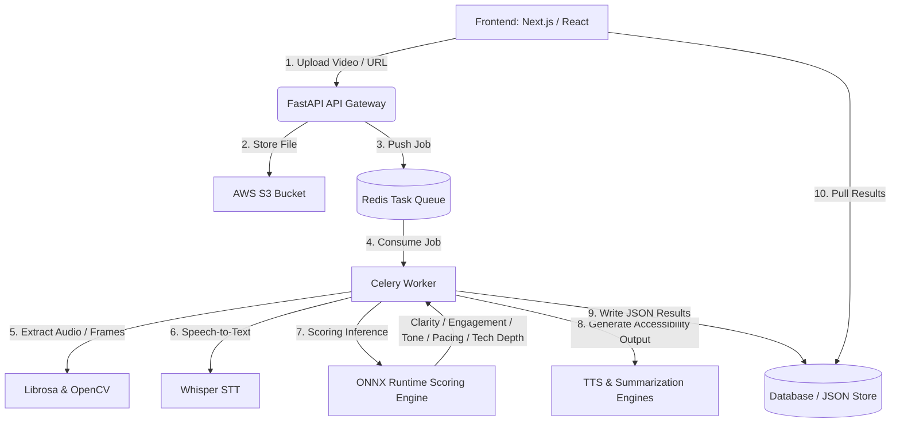

# MentorMind AI – Smart Video Evaluation & Accessibility Engine

MentorMind AI is an advanced, AI-powered platform designed to evaluate teaching quality in educational videos and transform them into accessible multimodal formats—**Blind Mode**, **Deaf Mode**, and **Easy Mode**. 

The system leverages **ONNX machine-learning models** for objective teaching assessment and uses **FastAPI** coupled with a distributed **Celery & Redis** task queue for heavy-lifting video processing. The frontend is built on a modern **Next.js 14** stack featuring custom **Recharts** dashboard analytics, progress trackers, and accessibility-first panels.

---

## Key Features

### 1. AI-Powered Video Evaluation & Scoring
Upload a teaching video to receive objective, weighted scores across 5 core teaching dimensions:
*   **Clarity (20%):** Measures visual and auditory explanation transparency.
*   **Engagement (20%):** Evaluates presentation style, audience interest indicators, and student retention rate.
*   **Tone & Confidence (15%):** Analyzes pitch, pacing confidence, and vocal variation.
*   **Pacing (15%):** Estimates teaching speed stability to prevent rushed or lagging sections.
*   **Technical Depth (30%):** Examines semantic depth, terminology usage, and complexity.

*Each metric is scored on a scale of 0 to 10.*

### 2. Multimodal Accessibility Modes
Convert any teaching session to accommodate students with diverse learning requirements:
*   **Blind Mode:** Generates a descriptive audio narration explaining visual components, slides, and math equations.
*   **Deaf Mode:** Transcribes speech to text using OpenAI's **Whisper STT** model, generating highly-accurate `.srt` and `.vtt` subtitles.
*   **Easy Mode:** Uses text summarization combined with text-to-speech (TTS) to provide a simplified, bite-sized audio overview of complex topics.

### 3. Interactive Analytics Dashboard
*   **Performance Profile:** 360° Radar charts and parameter-wise Bar charts built using Recharts.
*   **Inclusive Impact Log:** Comprehensive insights detailing how the lesson impacted students with accessibility needs.
*   **Interactive Queue Tracker:** A real-time visual progress bar tracking every step of the AI video evaluation process.
*   **Global Leaderboard & Admin Panels:** Track performance records and manage session submissions.

---

## System Architecture



### Component Breakdown

1.  **Frontend Layer (Next.js & Recharts):** Serves the interactive user dashboard, visual metrics profiling (radar & bar charts), and real-time processing status trackers.
2.  **API Gateway (FastAPI):** Validates video payload parameters, handles authentication boundaries, and immediately offloads heavy operations to the task queue.
3.  **Task Queue & Broker (Celery & Redis):** Redis manages message distribution and queues incoming processing requests. Celery workers execute computationally heavy tasks asynchronously.
4.  **Data Extraction & ML Inference (ONNX & Whisper):** OpenCV samples visual keyframes, Librosa extracts audio metrics, Whisper ASR generates transcripts, and specialized ONNX models run performance scoring.
5.  **Accessibility Conversion Pipelines:**
    *   **Deaf Mode:** Generates formatted `.srt` or `.vtt` captions using Whisper STT.
    *   **Blind Mode:** Generates a descriptive spoken narration track explaining visual transitions.
    *   **Easy Mode:** Summarizes transcripts via a text Transformer and converts it to speech.

---

## Project Structure

```
MentorMind-AI/
├── app/                      # Next.js App Router Pages
│   ├── dashboard/            # Mentor Dashboard, Leaderboard & Admin Panels
│   ├── evaluation/           # Evaluation reports & AI visual breakdown
│   ├── feedback/             # Student feedback & accessibility logs
│   ├── processing/           # Real-time processing progress screen
│   ├── globals.css           # Core tailwind styles & theme configurations
│   └── layout.tsx            # Main layout configuration
├── components/               # React UI Components
│   ├── ui/                   # Shadcn UI low-level primitives (Button, Card, etc.)
│   ├── cta-section.tsx       # Landing page CTA section
│   └── dashboard-preview.tsx # Mockups & widgets
├── hooks/                    # Custom React hooks
├── lib/                      # Helper libraries and utilities
├── public/                   # Static assets, SVG patterns, and icons
├── styles/                   # Style variables and additional configs
├── next.config.mjs           # Next.js configurations (Images and TS overrides)
├── tsconfig.json             # TypeScript settings
└── package.json              # Frontend packages and scripts
```

---

## Tech Stack & Dependencies

### Frontend
*   **Framework:** Next.js 14 (App Router)
*   **Language:** TypeScript
*   **Styling:** Tailwind CSS, Radix UI Primitives, Lucide Icons
*   **Charts:** Recharts (Radar, Bar, Cartesian Grids)

### Backend (Conceptual / Reference)
*   **API Framework:** FastAPI, Uvicorn
*   **Async Processing:** Celery, Redis
*   **Audio/Video Utils:** OpenCV, Librosa, MoviePy, Pydub
*   **AI Inference:** ONNX Runtime, Transformers, Whisper STT, PyTorch

---

## Setup & Running

### Frontend (Next.js)

1. **Install Dependencies:**
   ```bash
   pnpm install
   # or
   npm install
   ```

2. **Run Development Server:**
   ```bash
   pnpm dev
   # or
   npm run dev
   ```
   Open [http://localhost:3000](http://localhost:3000) to view the application.

3. **Build for Production:**
   ```bash
   pnpm build
   pnpm start
   ```

---

### Backend (FastAPI - Reference Setup)

1. **Clone & Environment Setup:**
   ```bash
   git clone https://github.com/your-repo/MentorMindAI.git
   cd MentorMindAI
   python -m venv venv
   ```

2. **Activate Environment:**
   *   **Windows:**
       ```powershell
       venv\Scripts\activate
       ```
   *   **Mac/Linux:**
       ```bash
       source venv/bin/activate
       ```

3. **Install Packages:**
   ```bash
   pip install -r requirements.txt
   ```

4. **Install FFmpeg (System Dependency):**
   *   **Windows:** `choco install ffmpeg`
   *   **Mac:** `brew install ffmpeg`

5. **Generate Mock ONNX Models:**
   ```bash
   python models/generate_dummy_models.py
   ```

6. **Start Backend Server:**
   ```bash
   uvicorn src.backend.app.main:app --reload
   ```
   Interactive Swagger documentation will be available at [http://localhost:8000/docs](http://localhost:8000/docs).

---

## API Documentation Reference

### Upload Video for Scoring
*   **Endpoint:** `POST /api/v1/upload/video`
*   **Content-Type:** `multipart/form-data`
*   **Response:**
    ```json
    {
      "file_id": "56c7e543-0b4e-49f6-9509-fb6cbe6bc9b6",
      "scores": {
        "clarity": 8.8,
        "engagement": 9.3,
        "tone": 8.6,
        "pacing": 8.4,
        "technical": 9.1
      },
      "overall_score": 8.95
    }
    ```

### Generate Accessibility Mode
*   **Endpoint:** `POST /api/v1/convert`
*   **Query Parameters:** `mode` (`blind` | `deaf` | `easy`)
*   **Response:**
    ```json
    {
      "status": "success",
      "output_path": "/mnt/data/uploads/video_deaf_mode.srt"
    }
    ```

---

## Contributors

*   **Shravani Tanksale (AI Lead):** Built scoring models, backend logic, Celery processing, accessibility modes, and end-to-end integration.
*   **Vidyankshini Vibhute (Frontend Lead):** Developed UI dashboards, charts, video upload flow, progress tracking, and connected frontend with backend.
*   **Devika Mule (Cloud/DevOps Lead):** Set up AWS S3, Redis, Celery, cloud architecture, deployment environments, and backend optimizations.

---

## Project Showcase


